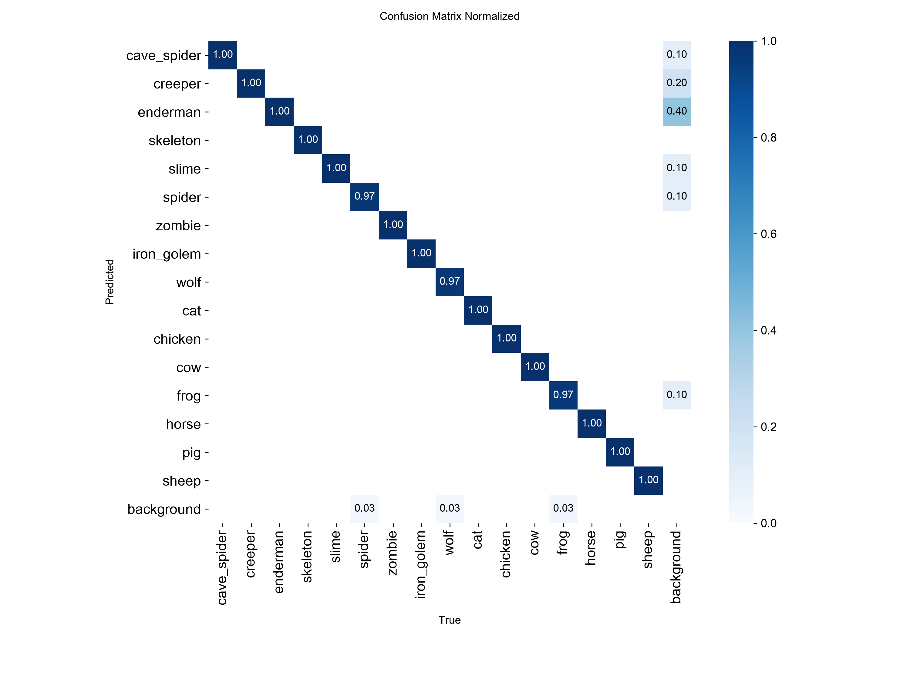
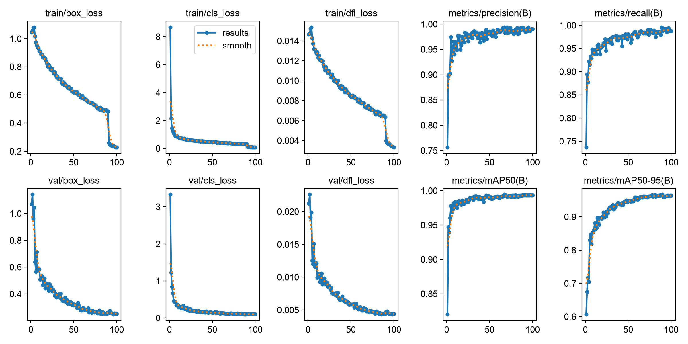
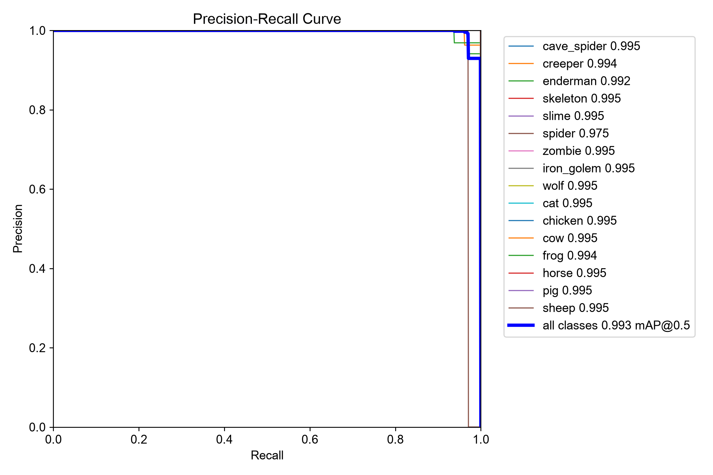
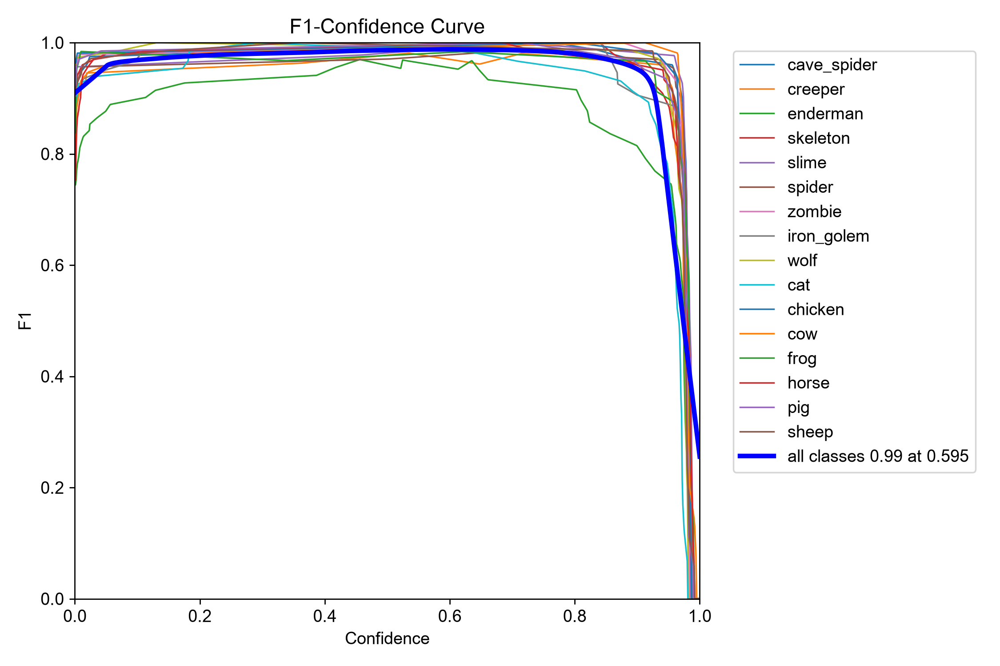
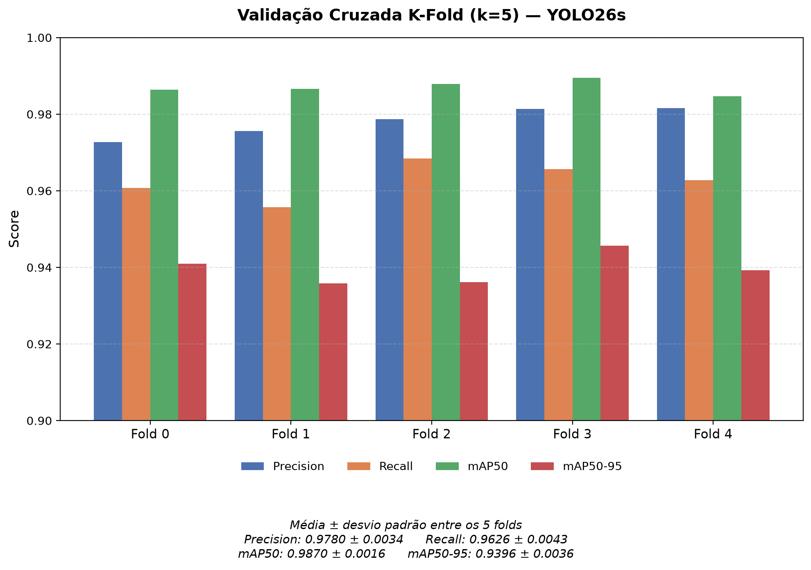
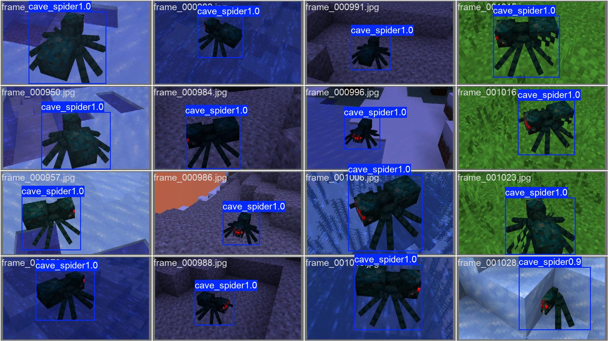
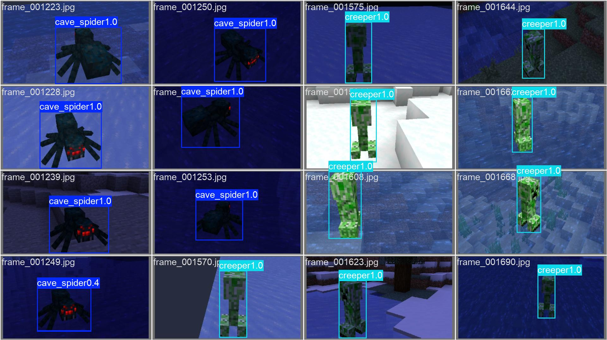

# Relatório de Treinamento — YOLOCraft

Modelo de detecção `MOB_DET_YOLO_V1` (YOLO26s), treinado para identificar 16 classes de mobs do Minecraft.

## Configuração do Treinamento

| Parâmetro | Valor |
|---|---|
| Arquitetura | YOLO26s (Ultralytics) |
| Pesos iniciais | `yolo26s.pt` (pré-treinado) |
| Dataset | `data/minecraft_mobs-2/apresentacao` (subconjunto curado, 16 classes) |
| Épocas | 100 |
| Batch size | 16 |
| Tamanho de imagem | 768x768 |
| Hardware | NVIDIA GeForce RTX 4060 Ti |
| Tempo de treino | 4h51min |

Classes: `cave_spider`, `creeper`, `enderman`, `skeleton`, `slime`, `spider`, `zombie`, `iron_golem`, `wolf`, `cat`, `chicken`, `cow`, `frog`, `horse`, `pig`, `sheep`.

## Métricas Gerais (conjunto de validação)

| Métrica | Valor |
|---|---|
| Precision | 0.9906 |
| Recall | 0.9878 |
| mAP50 | 0.9935 |
| mAP50-95 | 0.9679 |

Ver [images/metricas_formulas.png](images/metricas_formulas.png) para definição de cada métrica.

## Métricas por Classe

| Classe | Precision | Recall | AP50 | AP50-95 |
|---|---|---|---|---|
| cave_spider | 0.9890 | 1.0000 | 0.9950 | 0.9809 |
| creeper | 0.9620 | 0.9736 | 0.9939 | 0.9787 |
| enderman | 0.9679 | 0.9426 | 0.9923 | 0.9171 |
| skeleton | 0.9874 | 1.0000 | 0.9950 | 0.9735 |
| slime | 0.9806 | 1.0000 | 0.9950 | 0.9950 |
| spider | 0.9860 | 0.9706 | 0.9750 | 0.9660 |
| zombie | 0.9868 | 1.0000 | 0.9950 | 0.9692 |
| iron_golem | 0.9890 | 1.0000 | 0.9950 | 0.9531 |
| wolf | 1.0000 | 0.9828 | 0.9950 | 0.9445 |
| cat | 1.0000 | 0.9713 | 0.9950 | 0.9639 |
| chicken | 0.9908 | 1.0000 | 0.9950 | 0.9880 |
| cow | 0.9843 | 1.0000 | 0.9950 | 0.9699 |
| frog | 0.9926 | 0.9677 | 0.9941 | 0.9675 |
| horse | 0.9957 | 1.0000 | 0.9950 | 0.9754 |
| pig | 0.9951 | 1.0000 | 0.9950 | 0.9668 |
| sheep | 1.0000 | 0.9871 | 0.9950 | 0.9774 |

Todas as classes ficaram com AP50 acima de 0.97 — desempenho consistente, sem classe fraca destoando das demais. `enderman` é a classe com maior gap entre AP50 (0.9923) e AP50-95 (0.9171), indicando que quando o modelo erra, é mais por ajuste impreciso da caixa do que por falha de classificação.

## Matriz de Confusão

Matriz predominantemente diagonal — a esmagadora maioria das classes é classificada corretamente, com pouquíssima confusão entre classes diferentes. O resíduo de erro aparece majoritariamente como confusão com o "fundo" (detecção perdida), não como um mob sendo confundido com outro — reforça que o modelo aprendeu bem as características visuais que distinguem cada classe.

Versão não normalizada (contagem absoluta): [images/confusion_matrix.png](images/confusion_matrix.png)

## Curvas de Treinamento

Evolução de loss (caixa, classificação, DFL) e das métricas (precision, recall, mAP50, mAP50-95) ao longo das 100 épocas, para treino e validação. As curvas de métricas de validação estabilizam sem sinais de overfitting (loss de validação não diverge da de treino).

## Curvas Precision-Recall e F1

| Precision-Recall | F1 x Confidence |
|---|---|
|  |  |

A curva Precision-Recall próxima do canto superior direito confirma o mAP alto obtido. A curva F1 x confiança ajuda a escolher o threshold de operação: o pico do F1 indica o ponto de equilíbrio entre precision e recall (usado como referência para o `conf` padrão da API).

## Validação Cruzada (K-Fold, k=5)

Para verificar que o desempenho não depende de uma divisão específica dos dados, o dataset foi re-particionado em 5 folds (`sklearn.model_selection.KFold`), com 10 épocas de treino por fold.

| Fold | Precision | Recall | mAP50 | mAP50-95 |
|---|---|---|---|---|
| 0 | 0.9727 | 0.9607 | 0.9864 | 0.9410 |
| 1 | 0.9756 | 0.9557 | 0.9866 | 0.9358 |
| 2 | 0.9786 | 0.9684 | 0.9879 | 0.9361 |
| 3 | 0.9814 | 0.9657 | 0.9895 | 0.9457 |
| 4 | 0.9816 | 0.9628 | 0.9847 | 0.9392 |

**Média ± desvio padrão**: Precision = 0.9780 ± 0.0034 · Recall = 0.9627 ± 0.0043 · **mAP50 = 0.9870 ± 0.0016** · mAP50-95 = 0.9396 ± 0.0036

O desvio padrão do mAP50 entre os folds é inferior a 0.2%, evidência de que o desempenho do modelo é estável e não é resultado de um split de dados favorável.

## Exemplos Qualitativos

Predições do modelo em imagens do conjunto de validação (bounding boxes e classes previstas):

## Limitações Conhecidas

O modelo foi treinado em imagens capturadas com renderização padrão do jogo (sem shaders, resource packs ou pós-processamento). Em imagens que se afastam bastante dessa distribuição visual — iluminação muito diferente, texturas alternativas, maior suavização de bordas — a confiança das detecções cai, podendo resultar em falsos negativos mesmo quando o mob é claramente visível para um observador humano. Isso é esperado: as métricas acima refletem o desempenho no conjunto de validação, que segue a mesma distribuição do treino, não necessariamente qualquer imagem do mundo real. Ampliar a diversidade de condições de captura no dataset de treino é o caminho natural para reduzir esse tipo de erro.

## Arquivos de Referência

- Configuração completa do treino: `notebooks/3_experimentos/runs/detect/train/args.yaml`
- Histórico de todos os treinos (incluindo experimentos anteriores): `training_logs/training_history.csv`
- Notebook de validação cruzada: `notebooks/5_cross_validation/01_kfold_cv.ipynb`
- Modelo em produção: `models/production/MOB_DET_YOLO_V1.pt`
